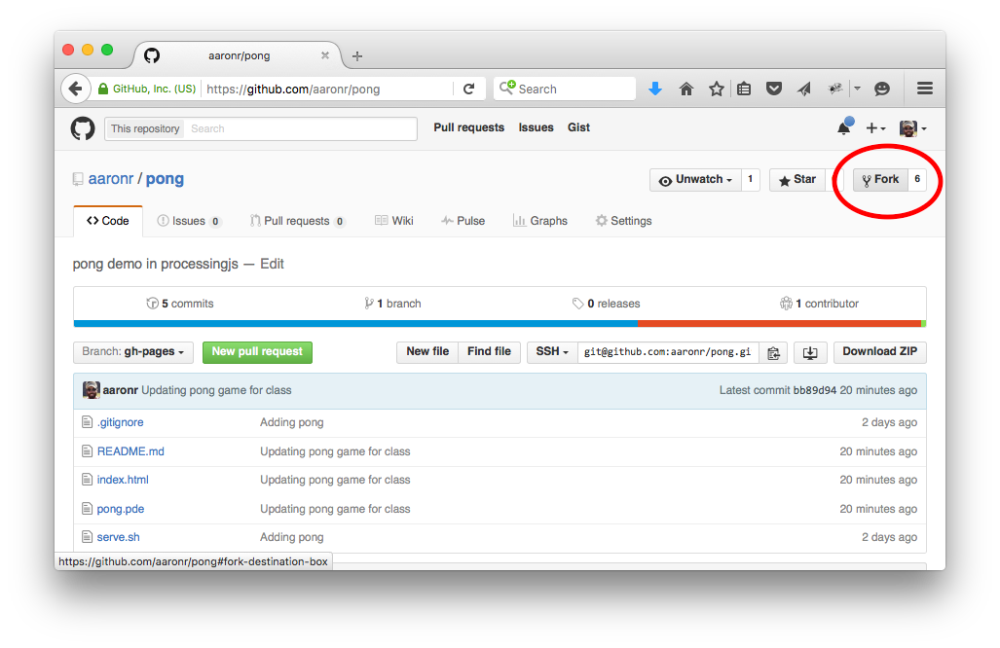
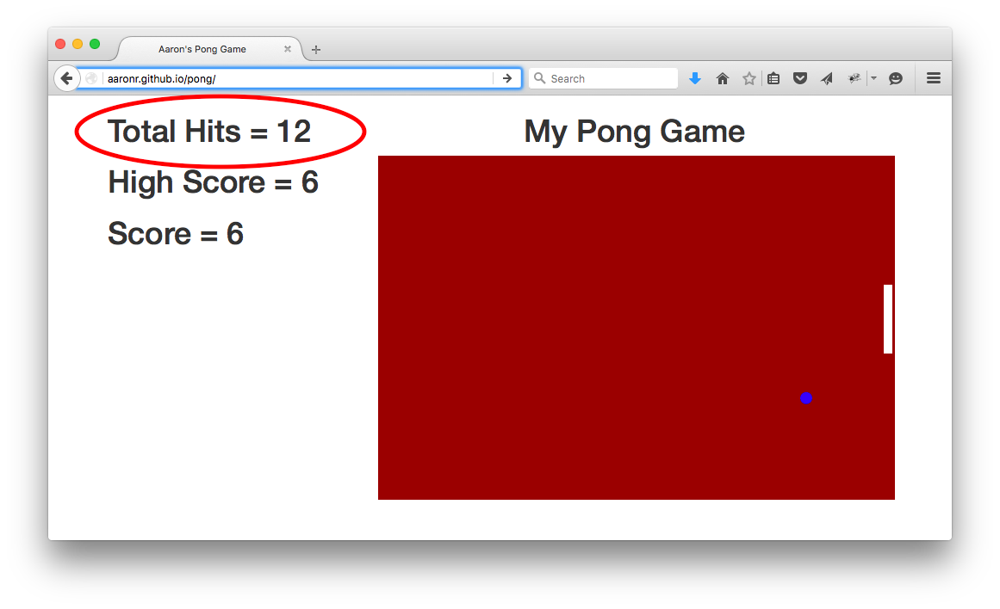
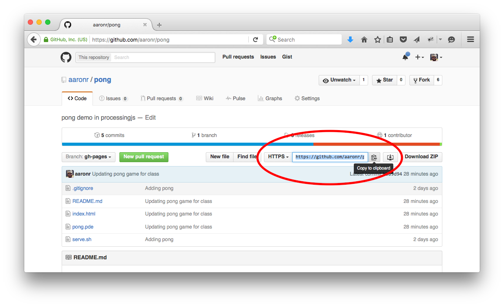
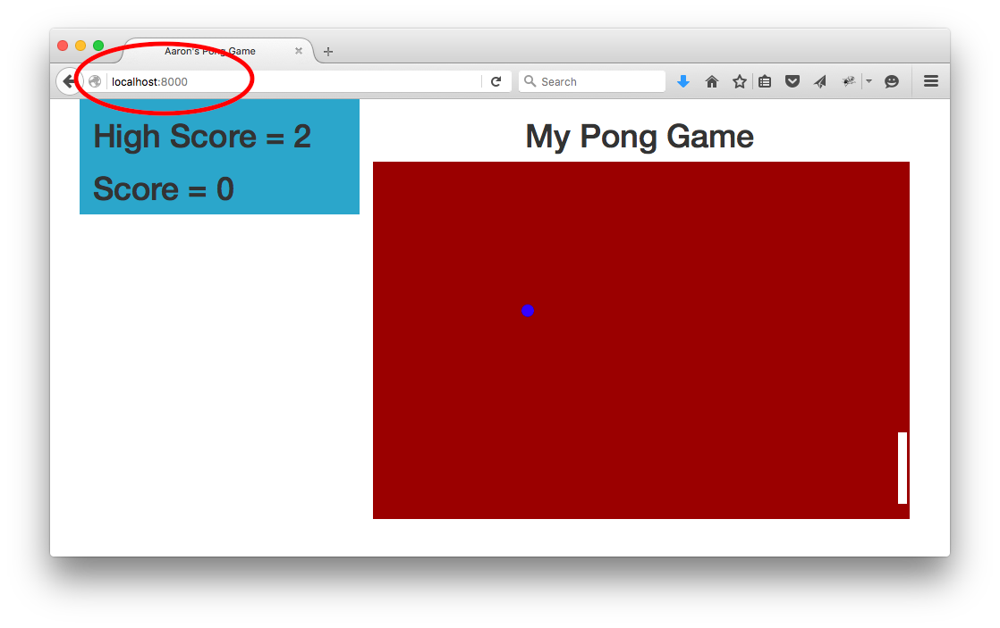

# Intro to Computer Science 2016 
## South Whidbey High School

---

The basic idea is to use a simple *Pong* game to learn some HTML, CSS, ProcessingJS, and github pages.

---

## Step #1
From your own user account in github (i.e. you have logged into github), navigate to https://github.com/aaronr/pong and press the `fork` button in the upper right corner of the page.  This will `fork` the pong repository into your personal github account!



## Step #2
Since the default branch of the pong repository is for [gh-pages](https://pages.github.com/) you should now be able to navigate to your github pages URL and view the pong game:

`https://<username>.github.io/pong`

After you play the game for a few minutes to see some of the features it will be time to dive in!

## Read over the index.html file
Head back to your repository page for the pong game and click on the index.html link.  Inside of the html file you will see the basic structure for the layout of the page.  Note the css and Javascript includes, the in-line css, the body of the html, and the scoreboard and pong game sections within the body.

## Read over the pong.pde file
This file is a [proessingjs](http://processingjs.org/) file and contains the logic for the game.

---

## Exercise #1
Navigate to the index.html page and change the title of the page from `Aaron's Pong Game` to your own custom title!

## Exercise #2
Navigate to the index.html page and change the cover heading over the pong game from `My Pong Game` to your own custom heading!

## Exercise #3
Navigate to the pong.pde file and change the speed of the ball.  Make it faster and slower... play around with what happens with strange numbers.

## Exercise #4
Navigate to the pong.pde file and change the size of the ball.  Make it bigger and smaller... play around with what happens with strange numbers.

## Exercise #5
Navigate to the pong.pde file and change the color of the ball, paddle, and the background of the game board.

## Exercise #6
Navigate to the pong.pde and index.html files and add in the `Total Hits` a player has made since loading the page.  There is code already commented into the files... find them and uncomment them to get the element to appear (via the html file) and update (via the pde file)



---

## Advanced #1
Open a `terminal` window on your mac.  Go to search and find the Terminal app.  Navigate to a directory of your choice to keep your project in.  

In the github interface for your pong repository find the `clone` url... it will look something like:

`https://github.com/aaronr/pong.git`



In the terminal window execute the following (using the URL you found above for YOUR repository):

`git clone https://github.com/aaronr/pong.git` 

Inside of that directory you now have a new pong directory containing your project... but local to your machine.

Open up finder... and navigate to the new folder with your pong project.  You can edit the files now locally... just like for the experiments above.

Navigate back to your terminal window and 'change directory' into the new pong directory with the following command:

`cd pong`

Once you are in the pong directory execute:

`./serve.sh`

You will see something like:

`Serving HTTP on 0.0.0.0 port 8000 ...`

You are now running a web server locally... on your very own desktop!  You can now point your browser to http://localhost:8000/ and see your pong game. If you edit a file now locally... all you have to do is re-fresh the webpage for localhost and you will see the changes!



Here is what the whole process would look like:

```
z-air:~ aaronr$ git clone https://github.com/aaronr/pong.git
Cloning into 'pong'...
remote: Counting objects: 20, done.
remote: Compressing objects: 100% (14/14), done.
remote: Total 20 (delta 6), reused 16 (delta 2), pack-reused 0
Unpacking objects: 100% (20/20), done.
z-air:~ aaronr$ cd pong
z-air:pong aaronr$ ./serve.sh
Serving HTTP on 0.0.0.0 port 8000 ...
```
